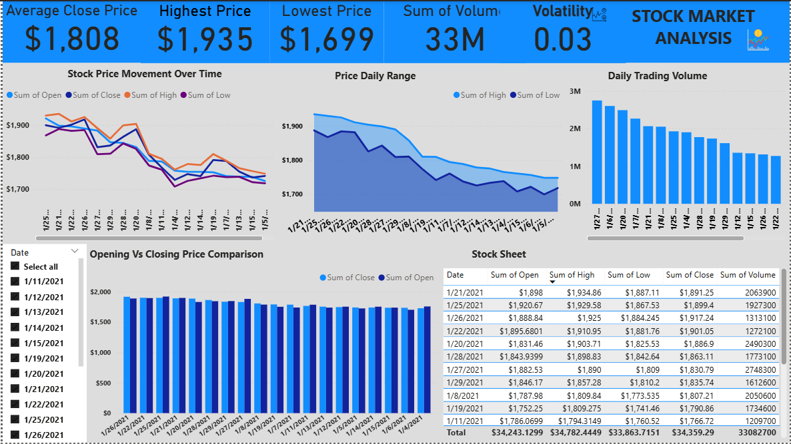

# stock-market-analysis-powerbi
Power BI dashboard analyzing stock price trends, volatility, and trading volume using historical market data.
# Stock Market Analysis Dashboard (Power BI)

## Project Overview

This project presents a Power BI dashboard analyzing historical stock market data to identify trends in price movement, trading volume, and market volatility.

The dashboard transforms raw financial data into visual insights that help understand stock behavior over time.

---

## Dashboard Preview



---

## Business Objective

Financial analysts and investors need tools to quickly analyze stock performance and market activity.

This dashboard helps answer key questions:

• How has the stock price moved over time?  
• What is the relationship between opening and closing prices?  
• When does trading activity increase or decrease?  
• How volatile is the stock on a daily basis?

---

## Dataset Description

The dataset contains historical stock market data with the following fields:

| Column | Description |
|------|------|
Date | Trading date |
Open | Opening price of the stock |
High | Highest price reached during the day |
Low | Lowest price during the day |
Close | Closing price |
Adj Close | Adjusted closing price |
Volume | Number of shares traded |

---

## Dashboard Features

### Stock Price Movement
Tracks open, high, low, and close prices over time.

### Daily Trading Volume
Shows how trading activity changes each day.

### Price Range Analysis
Visualizes the difference between daily high and low prices.

### Opening vs Closing Price
Compares opening and closing price behavior.

### Market Volatility
Measures daily price fluctuation using the difference between high and low values.

---

## Key Insights

• The stock shows a downward price trend across the selected time period.

• Trading volume fluctuates significantly across days, indicating periods of increased market activity.

• The difference between high and low prices highlights varying levels of market volatility.

• Several days show closing prices below opening prices, indicating bearish trading patterns.

---

## Tools Used

Power BI  
DAX  
Excel  
Data Visualization  
Time Series Analysis

---

## Project Structure

```
stock-market-analysis-powerbi
│
├── data
├── dashboard
├── images
├── README.md
├── dax_measures.md
├── insights.md
└── data_dictionary.md
```

---

## Author

Michael Ogundeji  
Aspiring Data Analyst  
Power BI | SQL | Excel | Data Analytics
